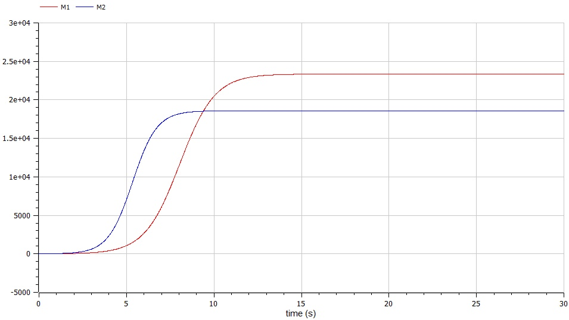
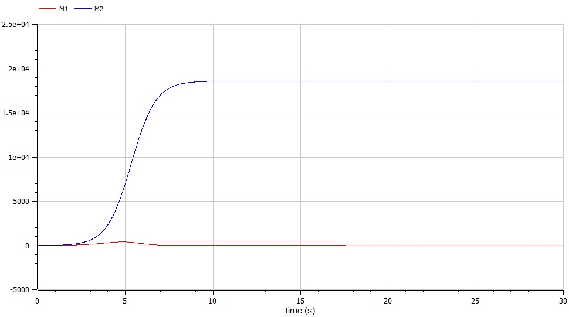

---
# Front matter
lang: ru-RU
title: Защита лабораторной работы №8. Модель конкуренции двух фирм
author: "Бурдина Ксения Павловна"
group: NFIbd-01-19
institute: RUDN University, Moscow, Russian Federation
date: 2022 Apr 1th

# Formatting
toc: false
slide_level: 2
header-includes: 
 - \metroset{progressbar=frametitle,sectionpage=progressbar,numbering=fraction}
 - '\makeatletter'
 - '\beamer@ignorenonframefalse'
 - '\makeatother'
aspectratio: 43
section-titles: true
theme: metropolis

---

# Результат выполнения лабораторной работы №8

# Цель выполнения лабораторной работы 

## Цель выполнения лабораторной работы

Необходимо научиться выполнять построение математической модели конкуренции двух фирм. Нужно рассмотреть задачу о фирмах, производящих взаимозаменяемые товары, и построить модель изменения объёмов продаж каждой из этих фирм.

# Задачи выполнения лабораторной работы

## Задачи выполнения лабораторной работы

- Провести рассуждения и записать дифференциальные уравнения изменения объёмов продаж фирм при заданных начальных условиях;

- Построить график изменения объёмов продаж для двух случаев:
1. Когда конкурентная борьба ведётся только рыночными методами и конкуренты могут влиять на противника путём изменения параметров своего производства;
2. Когда, помимо экономического фактора влияния, используются социально-психологические факторы – формирование общественного предпочтения одного товара другому, не зависимо от их качества и цены.

# Уравнения

## Уравнения

Переменные:

$$p_{cr} = 40,  N = 95, q=1$$
$$\tau _1 = 30,  \tau _2 = 27$$
$$\tilde{p}_1 = 11.5,  \tilde{p}_2 = 9.5$$

Начальные значения объёмов продаж:
$$M_0^1 = 7.5$$
$$M_0^2 = 8.5$$

## Уравнения

Нахождение коэффициентов:

$$a_1 = \frac{p_{cr}}{\tau_1^2\tilde{p}_1^2Nq},  a_2 = \frac{p_{cr}}{\tau_2^2\tilde{p}_2^2Nq}$$
$$b = \frac{p_{cr}}{\tau_1^2\tilde{p}_1^2\tau_2^2\tilde{p}_2^2Nq}$$
$$c_1 = \frac{p_{cr}-\tilde{p}_1}{\tau_1\tilde{p}_1},  c_2 = \frac{p_{cr}-\tilde{p}_2}{\tau_2\tilde{p}_2}$$

## Уравнения

Модель изменения объёмов продаж:

- для случая 1:
$$\frac{dM_1}{d\theta} = M_1-\frac{b}{c_1}M_1M_2-\frac{a_1}{c_1}M_1^2$$
$$\frac{dM_2}{d\theta} = \frac{c_2}{c_1}M_2-\frac{b}{c_1}M_1M_2-\frac{a_2}{c_1}M_2^2$$

- для случая 2:
$$\frac{dM_1}{d\theta} = M_1-(\frac{b}{c_1}+0.00016)M_1M_2-\frac{a_1}{c_1}M_1^2$$
$$\frac{dM_2}{d\theta} = \frac{c_2}{c_1}M_2-\frac{b}{c_1}M_1M_2-\frac{a_2}{c_1}M_2^2$$

# Результат выполнения лабораторной работы

## Результат выполнения лабораторной работы

Модель изменения объёмов продаж в случае 1:

{width=90%}

## Результат выполнения лабораторной работы

Модель изменения объёмов продаж в случае 2:

{width=90%}

# Вывод

## Вывод

- Провели рассуждения и выполнили построение математической модели конкуренции двух фирм для решения задачи;

- Получили дифференциальные уравнения, на основе которых решили задачу об изменении объёмов продаж со временем;

- Построили графики изменения объёмов продаж для двух случаев с учётом возможности ведения борьбы только рыночными методами и с помощью использования социально-психологических факторов.

