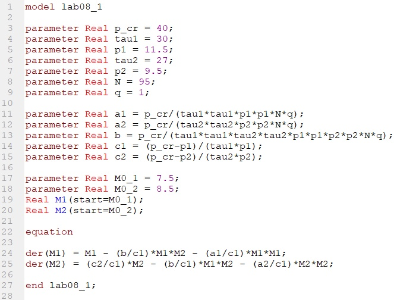
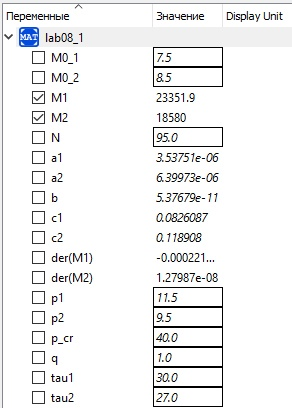
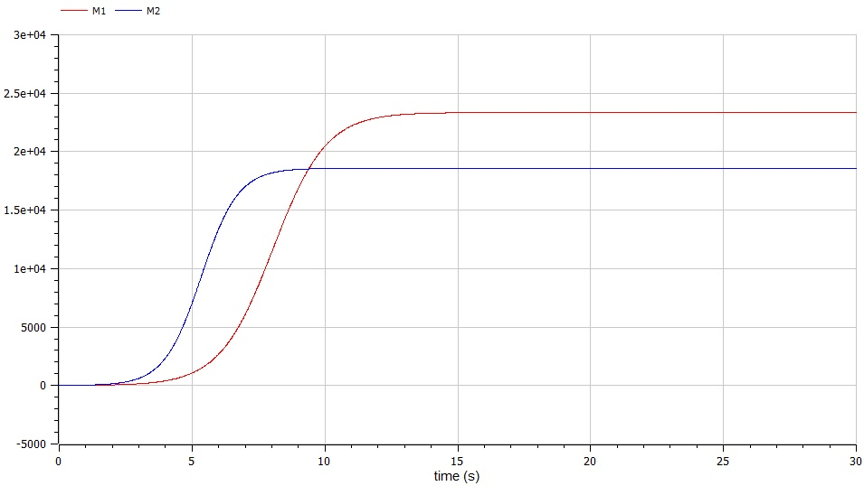
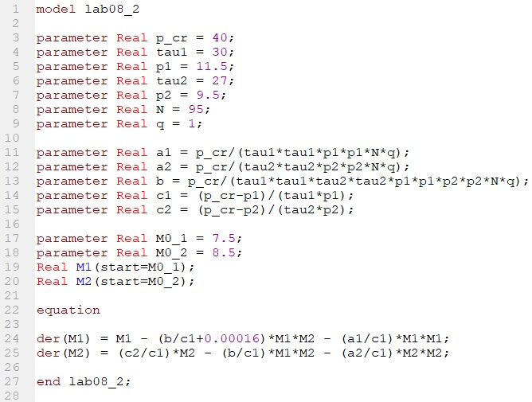
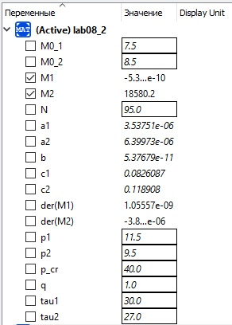
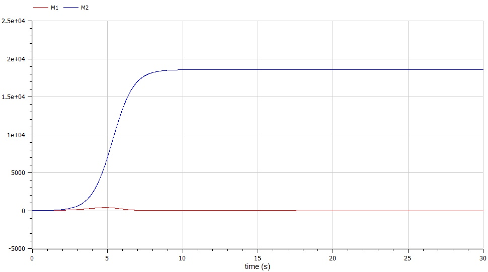

---
# Front matter
title: "Отчет по лабораторной работе №8"
subtitle: "Модель конкуренции двух фирм"
author: "Бурдина Ксения Павловна"
group: NFIbd-01-19
institute: RUDN University, Moscow, Russian Federation
date: 2022 Apr 1th

# Generic otions
lang: ru-RU
toc-title: "Содержание"

# Bibliography
csl: pandoc/csl/gost-r-7-0-5-2008-numeric.csl

# Pdf output format
toc: true # Table of contents
toc_depth: 2
lof: true # List of figures
fontsize: 12pt
linestretch: 1.5
papersize: a4
documentclass: scrreprt
### Fonts
mainfont: PT Serif
romanfont: PT Serif
sansfont: PT Sans
monofont: PT Mono
mainfontoptions: Ligatures=TeX
romanfontoptions: Ligatures=TeX
sansfontoptions: Ligatures=TeX,Scale=MatchLowercase
monofontoptions: Scale=MatchLowercase,Scale=0.9
## Biblatex
biblatex: true
biblio-style: "gost-numeric"
biblatexoptions:
  - parentracker=true
  - backend=biber
  - hyperref=auto
  - language=auto
  - autolang=other*
  - citestyle=gost-numeric
## Misc options
indent: true
header-includes:
  - \linepenalty=10 # the penalty added to the badness of each line within a paragraph (no associated penalty node) Increasing the value makes tex try to have fewer lines in the paragraph.
  - \interlinepenalty=0 # value of the penalty (node) added after each line of a paragraph.
  - \hyphenpenalty=50 # the penalty for line breaking at an automatically inserted hyphen
  - \exhyphenpenalty=50 # the penalty for line breaking at an explicit hyphen
  - \binoppenalty=700 # the penalty for breaking a line at a binary operator
  - \relpenalty=500 # the penalty for breaking a line at a relation
  - \clubpenalty=150 # extra penalty for breaking after first line of a paragraph
  - \widowpenalty=150 # extra penalty for breaking before last line of a paragraph
  - \displaywidowpenalty=50 # extra penalty for breaking before last line before a display math
  - \brokenpenalty=100 # extra penalty for page breaking after a hyphenated line
  - \predisplaypenalty=10000 # penalty for breaking before a display
  - \postdisplaypenalty=0 # penalty for breaking after a display
  - \floatingpenalty = 20000 # penalty for splitting an insertion (can only be split footnote in standard LaTeX)
  - \raggedbottom # or \flushbottom
  - \usepackage{float} # keep figures where there are in the text
  - \floatplacement{figure}{H} # keep figures where there are in the text
---

# Цель работы

Целью данной работы является построение математической модели конкуренции двух фирм на примере задачи о конкурирующих фирмах, производящих взаимозаменяемые товары и находящихся на одной рыночной нише.

# Задание

В ходе работы необходимо:

1. Прописать уравнения для построения модели изменения оборотных средств фирм 1 и 2 при условии, что число потребителей производимого продукта $N = 95$, а в начальный момент времени объём продаж у первой и второй фирм составляет $M_0^1 = 7.5$ и $M_0^2 = 8.5$ соответственно.

2. Построить графики изменения объёмов продаж у каждой из фирм со временем для двух случаев:
  - когда конкурентная борьба ведётся только рыночными методами и конкуренты могут влиять на противника путём изменения параметров своего производства;
  - когда, помимо экономического фактора влияния, используются социально-психологические факторы – формирование общественного предпочтения одного товара другому, не зависимо от их качества и цены.

# Теоретическое введение

Постановка задачи следующая:

Рассматриваются две фирмы, производящие взаимозаменяемые товары одинакового качества и находящиеся в одной рыночной нише.

В случае 1 считаем, что в рамках нашей модели конкурентная борьба ведётся только рыночными методами. То есть, конкуренты могут влиять на противника путем изменения параметров своего производства: себестоимость, время цикла, но не могут прямо вмешиваться в ситуацию на рынке («назначать» цену или влиять на потребителей каким-либо иным способом). Будем считать, что постоянные издержки пренебрежимо малы, и в модели учитывать не будем. 

В данном случае решение исходной задачи сводится к решению системы дифференциальных уравнений:

$$\frac{dM_1}{d\theta} = M_1-\frac{b}{c_1}M_1M_2-\frac{a_1}{c_1}M_1^2$$
$$\frac{dM_2}{d\theta} = \frac{c_2}{c_1}M_2-\frac{b}{c_1}M_1M_2-\frac{a_2}{c_1}M_2^2$$

В случае 2 помимо экономического фактора влияния (изменение себестоимости, производственного цикла, использование кредита и т.п.), используются еще и социально-психологические факторы – формирование общественного предпочтения одного товара другому, не зависимо от их качества и цены. В этом случае взаимодействие двух фирм будет зависеть друг от друга, соответственно коэффициент перед $M_1M_2$ будет отличаться.

В данном случае решение исходной задачи сводится к решению следующей системы дифференциальных уравнений:

$$\frac{dM_1}{d\theta} = M_1-(\frac{b}{c_1}+0.00016)M_1M_2-\frac{a_1}{c_1}M_1^2$$
$$\frac{dM_2}{d\theta} = \frac{c_2}{c_1}M_2-\frac{b}{c_1}M_1M_2-\frac{a_2}{c_1}M_2^2$$

# Выполнение лабораторной работы

1. Для построения модели конкуренции хотя бы двух фирм необходимо рассмотреть модель одной фирмы. Сначала рассмотрим модель фирмы, производящей продукт долговременного пользования, когда цена его определяется балансом спроса и предложения. Примем, что этот продукт занимает определенную нишу рынка и конкуренты в ней отсутствуют.

2. Введем обозначения переменных для использования в уравнениях, необходимых при решении задач:

    $N$ – число потребителей производимого продукта.

    $S$ – доходы потребителей данного продукта. Считаем, что доходы всех потребителей одинаковы. Это предположение справедливо, если речь идет об одной рыночной нише, т.е. производимый продукт ориентирован на определенный слой населения.

    $M$ – оборотные средства предприятия.

    $\tau$ – длительность производственного цикла.

    $p$ – рыночная цена товара.

    $\tilde{p}$ – себестоимость продукта, т.е. переменные издержки на производство единицы продукции.

    $\delta$ – доля оборотных средств, идущая на покрытие переменных издержек.

    $k$ – постоянные издержки, которые не зависят от количества выпускаемой продукции.

    $Q(S/p)$ – функция спроса, зависящая от отношения дохода $S$ к цене $p$. Она равна количеству продукта, потребляемого одним потребителем в единицу времени.

3. Функцию спроса товаров долговременного использования часто представляют в простейшей форме:

    $Q=q-k\frac{p}{S}=q(1-\frac{p}{p_{cr}})$

    Эта функция падает с ростом цены и при $p = p_{cr}$ потребители отказываются от приобретения товара. Величина $p_{cr} = \frac{Sq}{k}$. Параметр $k$ – мера эластичности функции спроса по цене. Таким образом, функция спроса в пороговой (то есть, $Q(\frac{S}{p}) = 0$ при $p ≥ p_{cr})$ и обладает свойствами насыщения.

    Уравнения динамики оборотных средств можно записать в виде:

    $$\frac{dM}{dt}=-\frac{M\delta}{\tau}+NQp-k=-\frac{M\delta}{\tau}+Nq(1-\frac{p}{p_{cr}})p-k$$

    Уравнение для рыночной цены $p$ представим в виде:

    $$\frac{dp}{dt}=\gamma(-\frac{M\delta}{\tau \tilde{p}}+Nq(1-\frac{p}{p_{cr}}))$$

    Параметр $γ$ зависит от скорости оборота товаров на рынке. Как правило, время торгового оборота существенно меньше времени производственного цикла $τ$. При заданном $M$ уравнение, написанное выше, описывает быстрое стремление цены к равновесному значению цены, которое устойчиво.

4. Заменим уравнение для рыночной цены $p$ алгебраическим соотношением:

    $$-\frac{M\delta}{\tau \tilde{p}}+Nq(1-\frac{p}{p_{cr}})=0$$

    Из него следует, что равновесное значение цены $p$ равно:

    $$p=p_{cr}(1-\frac{M\delta}{\tau \tilde{p}Nq})$$

    В итоге уравнение для рыночной цены приобретает вид:

    $$\frac{dM}{dt}=M\frac{\delta}{\tau}(\frac{p_{cr}}{\tilde{p}}-1)-M^2(\frac{\delta}{\tau \tilde{p}})^2\frac{p_{cr}}{Nq}-k$$

    Полученное уравнение имеет два стационарных решения, соответствующих условию $dM/dt=0$: $$\tilde{M_{1,2}}=\frac{1}{2}a\pm \sqrt{\frac{a^2}{4}-b}$$ где $$a=Nq(1-\frac{\tilde{p}}{p_{cr}})\tilde{p}\frac{\tau}{\delta},   b=kNq\frac{(\tau \tilde{p})^2}{p_{cr}\delta ^2}$$

    Из вышепредставленного уравнения следует, что при больших постоянных издержках (в случае $a^2 < 4b$) стационарных состояний нет. Это означает, что в этих условиях фирма не может функционировать стабильно, то есть терпит банкротство. Однако, как правило, постоянные затраты малы по сравнению с переменными (то есть, $b << a^2$) и играют роль только в случае, когда оборотные средства малы. При $b << a$ стационарные значения $M$ равны:

    $$\tilde{M_+}=Nq\frac{\tau}{\delta}(1-\frac{\tilde{p}}{p_{cr}})\tilde{p},   \tilde{M_-}=k\tilde{p}\frac{\tau}{\delta(p_{cr}-\tilde{p})}$$

    Первое состояние $\tilde{M_+}$ устойчиво и соответствует стабильному функционированию предприятия. Второе состояние $\tilde{M_-}$ неустойчиво, так что при $M<\tilde{M_-}$ оборотные средства падают ($dM/dt < 0$), то есть, фирма идет к банкротству. По смыслу $\tilde{M_-}$ соответствует начальному капиталу, необходимому для входа в рынок.

5. Перейдем к случаям конкуренции двух фирм [[1]](https://esystem.rudn.ru/pluginfile.php/1343905/mod_resource/content/2/%D0%9B%D0%B0%D0%B1%D0%BE%D1%80%D0%B0%D1%82%D0%BE%D1%80%D0%BD%D0%B0%D1%8F%20%D1%80%D0%B0%D0%B1%D0%BE%D1%82%D0%B0%20%E2%84%96%207.pdf). 
Рассмотрим две фирмы, производящие взаимозаменяемые товары одинакового качества и находящиеся в одной рыночной нише. Последнее означает, что у потребителей в этой нише нет априорных предпочтений, и они приобретут тот или иной товар, не обращая внимания на знак фирмы. В этом случае, на рынке устанавливается единая цена, которая определяется балансом суммарного предложения и спроса. Иными словами, в рамках нашей модели конкурентная борьба ведётся только рыночными методами. То есть, конкуренты могут влиять на противника путем изменения параметров своего производства: себестоимость, время цикла, но не могут прямо вмешиваться в ситуацию на рынке («назначать» цену или влиять на потребителей каким-либо иным способом).

    Уравнение динамики оборотных средств запишем в виде:

    $$\frac{dM_1}{d\theta} = M_1-\frac{b}{c_1}M_1M_2-\frac{a_1}{c_1}M_1^2$$
    $$\frac{dM_2}{d\theta} = \frac{c_2}{c_1}M_2-\frac{b}{c_1}M_1M_2-\frac{a_2}{c_1}M_2^2$$

    Коэффициенты в данных уравнениях находятся с помощью следующих выражений:

    $$a_1 = \frac{p_{cr}}{\tau_1^2\tilde{p}_1^2Nq},  a_2 = \frac{p_{cr}}{\tau_2^2\tilde{p}_2^2Nq}$$
    $$b = \frac{p_{cr}}{\tau_1^2\tilde{p}_1^2\tau_2^2\tilde{p}_2^2Nq}$$
    $$c_1 = \frac{p_{cr}-\tilde{p}_1}{\tau_1\tilde{p}_1},  c_2 = \frac{p_{cr}-\tilde{p}_2}{\tau_2\tilde{p}_2}$$

    Для решения также введем нормировку $t=c_1\theta$.

6. Рассмотрим также иной случай. Теперь при построении модель будем учитывать то, что помимо экономического фактора влияния (изменение себестоимости, производственного цикла, использование кредита и т.п.), используются еще и социально-психологические факторы – формирование общественного предпочтения одного товара другому, не зависимо от их качества и цены. В этом случае взаимодействие двух фирм будет зависеть друг от друга, соответственно коэффициент перед $M_1M_2$ будет отличаться.

    Уравнения для данного случая имеют следующий вид:

    $$\frac{dM_1}{d\theta} = M_1-(\frac{b}{c_1}+0.00016)M_1M_2-\frac{a_1}{c_1}M_1^2$$
    $$\frac{dM_2}{d\theta} = \frac{c_2}{c_1}M_2-\frac{b}{c_1}M_1M_2-\frac{a_2}{c_1}M_2^2$$

    Для решения соответствующих уравнений необходимо задать начальные условия. Считаем, что на начало конкуренции объем продаж в момент времени $t_0$ у фирмы 1 и фирмы 2 составлял $M_0^1$ млн. и $M_0^2$ млн. единиц соответственно. 

7. Напишем программу для расчёта изменения объемов продаж в OpenModelica. 

    Введем значения для параметров, используемых при решении уравнений:

    $p(cr) = 40,  N = 95, q = 1$
    
    $tau1 = 30,  tau2 = 27$
    
    $p1 = 11.5,  p2 = 9.5$

    Зададим начальное состояние системы:
    $$M01 = 7.5$$
    $$M02 = 8.5$$

    Установим, что переменные $M1, M2$ имеют начальные значения $M01, M02$ соответственно.

    Запишем выражения для подсчета значений коэффициентов $a1, a2, b, c1, c2$, на основе которых будем решать систему уравнений. Запишем непосредственно дифференциальные уравнение, описывающие нашу модель, для первого случая:
    $$der(M1) = M1-(b/c1)*M1*M2 - (a1/c1)*M1*M1$$
    $$der(M2) = (c2/c1)*M2-(b/c1)*M1*M2 - (a2/c1)*M2*M2$$

    {width=80%}

    {width=60%}

    Установим, что промежуток времени, на котором мы рассматриваем изменение объемов продаж: $t \in [0:30]$, а шаг составляет $0.01$

    

    В результате выполнения данной программы получаем следующий график изменения объемов продаж первой и второй фирм:

    

8. Напишем программу для расчёта изменения объемов продаж для второго случая. Начальное состояние системы остается прежним:
    $$M01 = 7.5$$
    $$M02 = 8.5$$

    Значения для параметров, используемых при решении уравнений, остаются прежними:

    $p(cr) = 40,  N = 95, q = 1$
    
    $tau1 = 30,  tau2 = 27$
    
    $p1 = 11.5,  p2 = 9.5$

    Выражения для подсчета значений коэффициентов $a1, a2, b, c1, c2$, также не изменяются.
    
    Дифференциальные уравнение, описывающие нашу модель в случае 2:
    $$der(M1) = M1-(b/c1+0.00016)*M1*M2 - (a1/c1)*M1*M1$$
    $$der(M2) = (c2/c1)*M2-(b/c1)*M1*M2 - (a2/c1)*M2*M2$$

    {width=80%}

    {width=60%}

    В результате выполнения данной программы получаем следующий график изменения объемов продаж первой и второй фирм:

    

# Выводы

В процессе выполнения работы мы построили модель конкуренции двух фирм на примере задачи об изменении объемов продаж первой и второй фирм с течением времени. Получили дифференциальные уравнения для построения модели изменения объемов продаж с учетом начального состояния системы для двух случаев. Построили графики изменения объемов продаж с учетом условий, когда конкурентная борьба ведётся только рыночными методами и когда, помимо экономического фактора влияния, используются социально-психологические факторы.

# Список литературы

1. Методические материалы курса "Математическое моделирование" [[1]](https://esystem.rudn.ru/pluginfile.php/1343905/mod_resource/content/2/%D0%9B%D0%B0%D0%B1%D0%BE%D1%80%D0%B0%D1%82%D0%BE%D1%80%D0%BD%D0%B0%D1%8F%20%D1%80%D0%B0%D0%B1%D0%BE%D1%82%D0%B0%20%E2%84%96%207.pdf).

2. Динамическая модель конкуренции двух фирм на однородном рынке. Электронный справочник [[2]](https://natural-sciences.ru/ru/article/view?id=14730).
